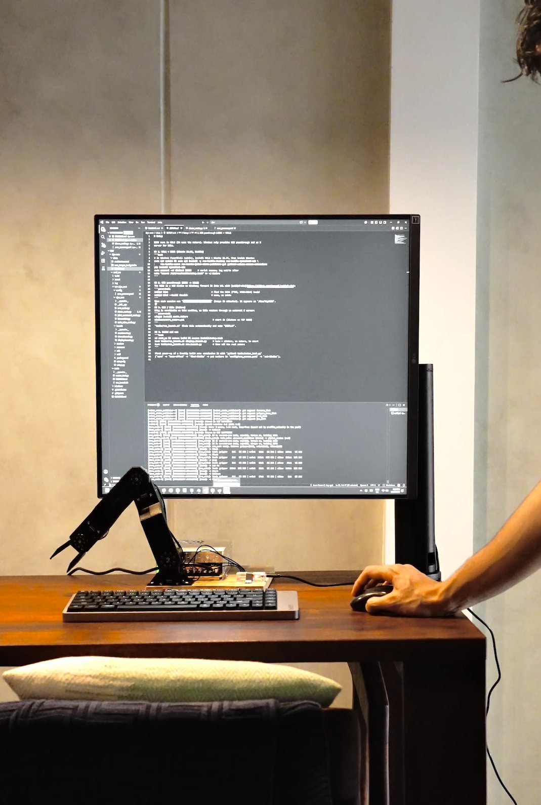
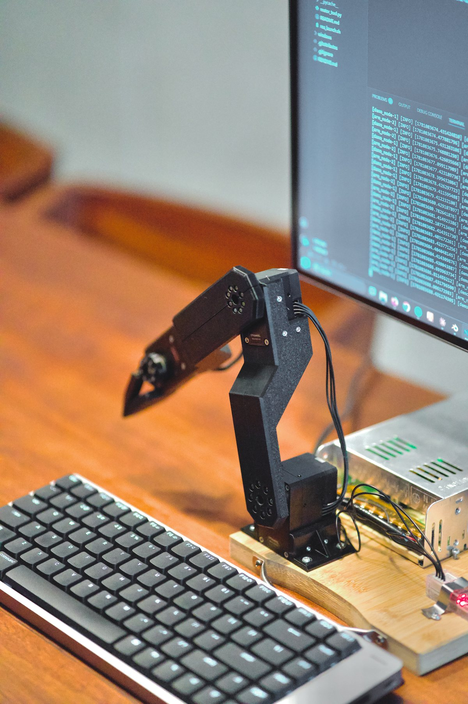
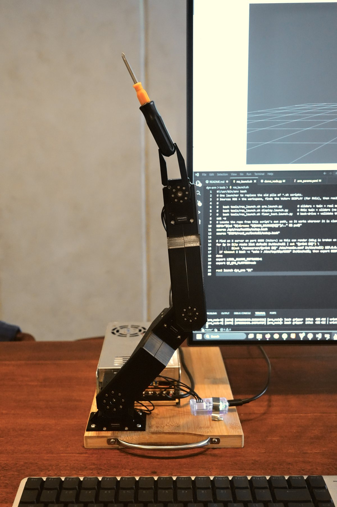
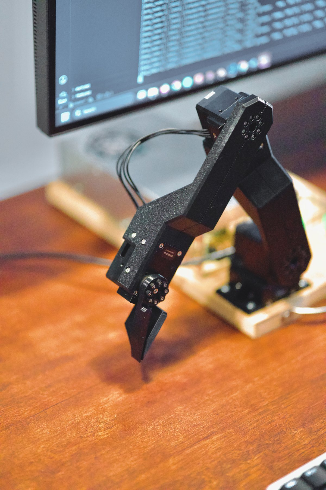

# dyn-arm



A 3-DOF ROS2 robotic arm using Dynamixel servos, 3D-printed structure, a U2D2
USB serial converter, and an RViz digital twin.

## What is included

- ROS2 Humble package for the arm driver, RViz model, and demo.
- STL files in `ros2_ws/src/dyn_arm/meshes/`.
- Motor setup tools in `tools/motor_tool.py`.
- Windows/WSL helpers for U2D2 passthrough and RViz display.
- Safety layers: joint limits, firmware limits, virtual floor, torque caps, and
  watchdog home fallback.

## Hardware

| Qty | Part |
| --- | --- |
| 2 | Dynamixel XM430-W210-R |
| 1 | Dynamixel XM540-W270-R |
| 1 | U2D2 USB serial converter |
| 1 | USB-C cable |
| 1 | 12 V 30 A power supply |
| 1 | Wooden platform |
| 1 | 3D printer |
| 8 | M3 x 10 mm bolts |
| 16 | M3 x 6 mm bolts |
| 8 | M2.5 x 10 mm bolts |
| 8 | M2.5 x 8 mm bolts |

Printed parts are in `ros2_ws/src/dyn_arm/meshes/`. PLA at 50% infill worked
for this build.

## Setup

Install ROS2 Humble on Ubuntu 22.04, then install the project dependencies:

```bash
sudo apt update
sudo apt install -y \
  ros-humble-desktop \
  ros-humble-dynamixel-sdk \
  ros-humble-xacro \
  ros-humble-joint-state-publisher-gui \
  python3-colcon-common-extensions

pip install dynamixel-sdk
sudo usermod -aG dialout $USER
```

Build the workspace:

```bash
cd ros2_ws
colcon build
source install/setup.bash
cd ..
```

For WSL2 USB/RViz notes and first motor setup, see [docs/SETUP.md](docs/SETUP.md).

## Commissioning

With the U2D2 attached as `/dev/ttyUSB0` and the 12 V motor supply on:

```bash
python3 tools/motor_tool.py scan
python3 tools/motor_tool.py zero
python3 tools/motor_tool.py find-limits
```

Copy the measured joint limits into
`ros2_ws/src/dyn_arm/config/arm_params.yaml`, then write them to the motors:

```bash
python3 tools/motor_tool.py set-limits
```

The config arrays are ordered `[gripper, wrist, elbow]`.

## Run

Digital twin only:

```bash
bash tools/ros_launch.sh display.launch.py
```

Real arm with RViz sliders:

```bash
bash tools/ros_launch.sh arm.launch.py
```

Scripted demo:

```bash
bash tools/ros_launch.sh demo.launch.py
```

## More photos







## Docs

- [Setup guide](docs/SETUP.md)
- [Architecture notes](docs/architecture.md)
- [Torque budget](docs/arm_torque_budget.xlsx)
- [Motor tool reference](tools/README.md)

## License

MIT. See [LICENSE](LICENSE).
